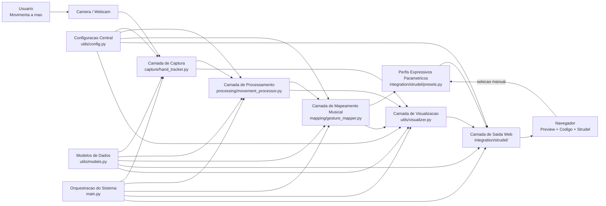
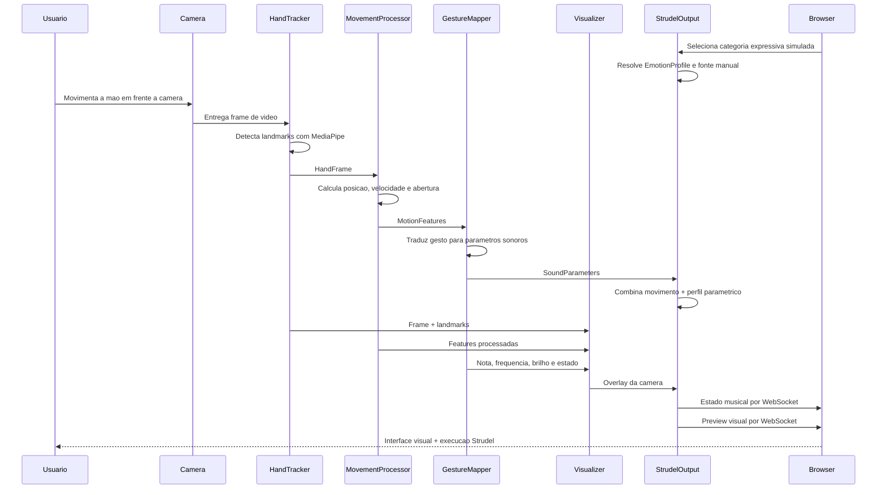
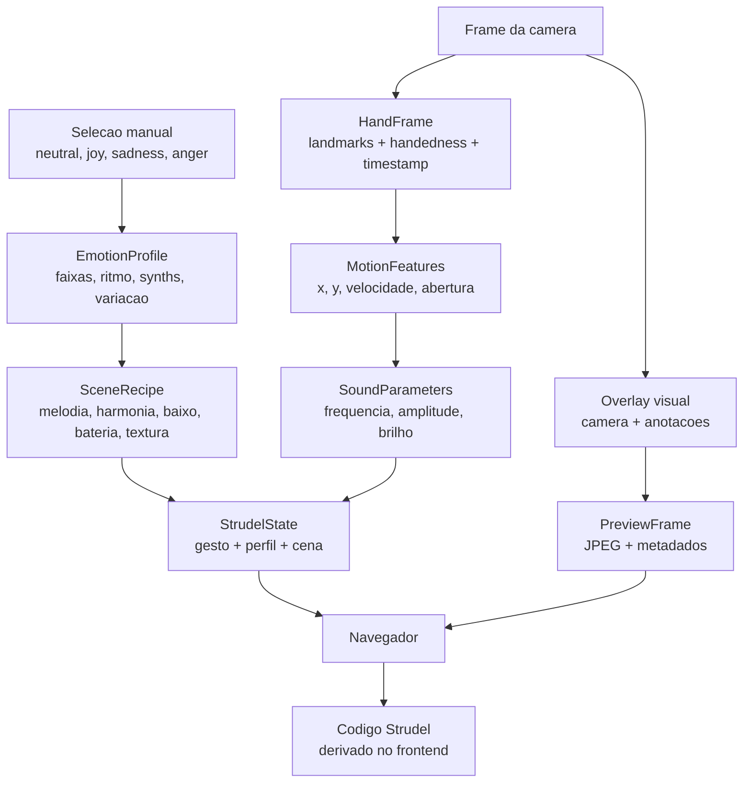

# Arquitetura Do Sistema

Este documento descreve a arquitetura atual do `MoveCodeBeats` em sua fase browser-first. O objetivo e mostrar como o movimento capturado pela camera percorre cada camada do sistema ate resultar em preview visual e execucao Strudel no navegador.

## Versao UML

Os diagramas UML em PlantUML estao em `docs/uml/`.

## Visao Geral Em Camadas

## Fluxo De Dados Em Tempo Real

## Papel De Cada Camada

- `main.py`: inicia o sistema, instancia os modulos, controla o loop principal e encerra os recursos corretamente.
- `capture/hand_tracker.py`: abre a camera, prepara o modelo do MediaPipe, detecta a mao e converte o resultado para a estrutura `HandFrame`.
- `processing/movement_processor.py`: transforma landmarks em features semanticas mais estaveis, como posicao suavizada, velocidade e abertura da mao.
- `mapping/gesture_mapper.py`: traduz essas features em parametros musicais e acusticos, como nota, frequencia, amplitude e brilho.
- `integration/strudel/`: publica o estado Strudel estruturado, expande o preview da camera e entrega tudo para o navegador.
- `utils/visualizer.py`: desenha a malha da mao, os indices dos landmarks e a identificacao das maos para depuracao e demonstracao.
- `utils/config.py`: centraliza os parametros configuraveis do sistema.
- `utils/models.py`: define as estruturas de dados trocadas entre as camadas.
- `tests/`: valida partes importantes da logica sem depender de camera real.

## Estruturas De Dados Que Interligam O Sistema

## Justificativa Arquitetural

- A separacao em camadas reduz acoplamento e facilita manutencao.
- O uso de estruturas de dados intermediarias torna o fluxo claro e testavel.
- A centralizacao da interface no navegador aproxima o prototipo da ideia central de integracao com Strudel.
- A remocao do sintetizador local reduz redundancia e concentra a evolucao do projeto na traducao gesto -> codigo executavel.
- A selecao manual de categoria fica desacoplada da regra musical, permitindo que um classificador substitua essa origem no futuro sem alterar o gerador Strudel.
- As cenas sao declarativas e deterministicas: o mesmo perfil e estado produzem a mesma receita, permitindo testes e comparacoes controladas.
- O frontend compila a cena estruturada sem conhecer as regras de classificacao ou deteccao gestual.
