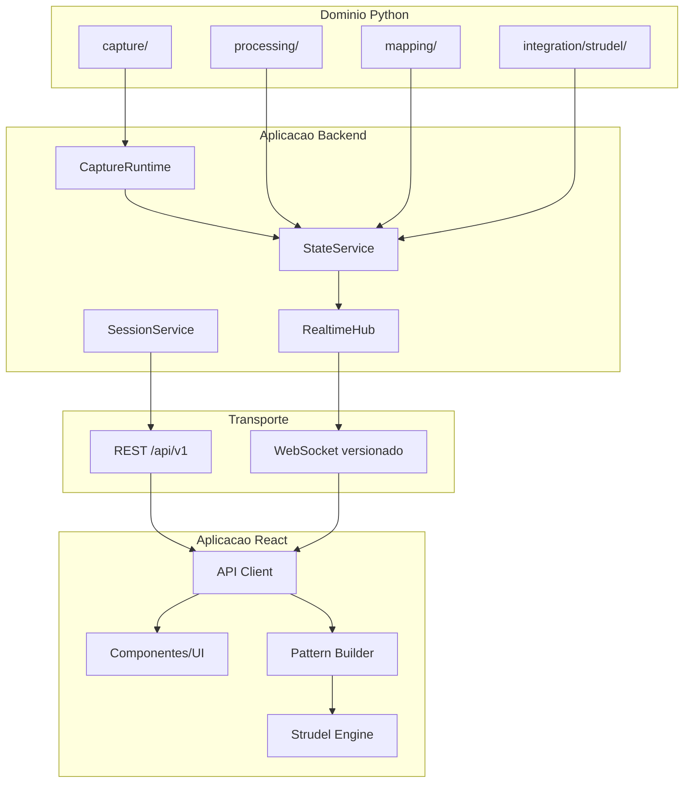
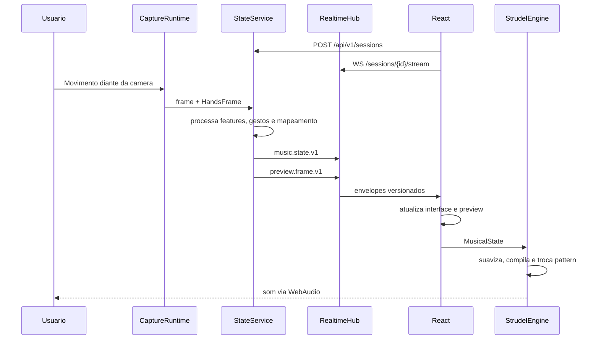

# Arquitetura Do Sistema

## Visao Geral

```mermaid
flowchart LR
    U["Usuario"] --> C["Camera"]
    C --> H["HandTracker<br/>MediaPipe"]
    H --> P["MovementProcessor<br/>features + gestos"]
    P --> M["GestureMapper<br/>parametros musicais"]
    M --> S["StateService<br/>perfil + cena"]
    S --> API["FastAPI REST/WebSocket"]
    API --> R["React + TypeScript"]
    R --> B["PatternBuilder"]
    B --> E["StrudelEngine"]
    E --> A["WebAudio"]
    S --> V["PreviewPublisher"]
    V --> API
```



## Camadas



## Sequencia Em Tempo Real



## Responsabilidades

- `CaptureRuntime`: executa camera e MediaPipe em thread dedicada.
- `StateService`: coordena processamento, mapeamento, perfil, cena e preview,
  sem depender de FastAPI.
- `RealtimeHub`: atravessa com seguranca a fronteira thread/asyncio e distribui
  eventos aos WebSockets.
- `SessionService`: cria sessoes e registra a selecao manual de perfil.
- `FastAPI`: valida contratos, publica REST, WebSocket, CORS e OpenAPI.
- `MoveCodeBeatsApi`: cliente TypeScript da API.
- `patternBuilder.ts`: unica fonte do codigo/pattern Strudel.
- `engine.ts`: inicializa samples, controla CPS, suaviza valores e usa
  `setPattern` sem reiniciar o scheduler.

## Contratos

Os eventos possuem envelope `1.0`:

```json
{
  "schema_version": "1.0",
  "type": "music.state.v1",
  "timestamp": 1770000000.0,
  "session_id": "uuid",
  "data": {}
}
```

O backend transmite dados musicais declarativos, nao JavaScript executavel. O
frontend compila esses dados para Strudel. Essa fronteira evita executar codigo
recebido da rede e deixa o motor musical independente do transporte.

## Implantacao Atual E Futura

Nas fases 0 a 4, backend e frontend podem ser hospedados separadamente, mas o
backend ainda precisa estar conectado a webcam. Para uso totalmente online, a
fase seguinte deve mover `getUserMedia` e MediaPipe para o navegador ou adotar
um agente local autenticado.
