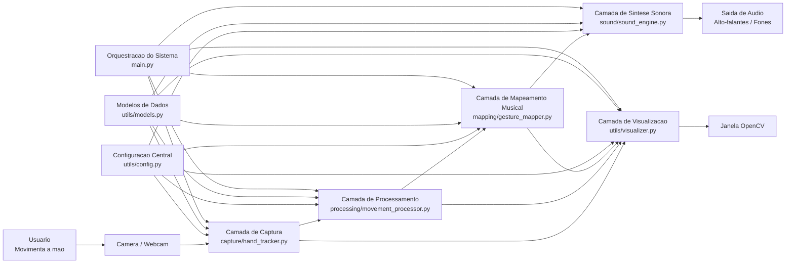
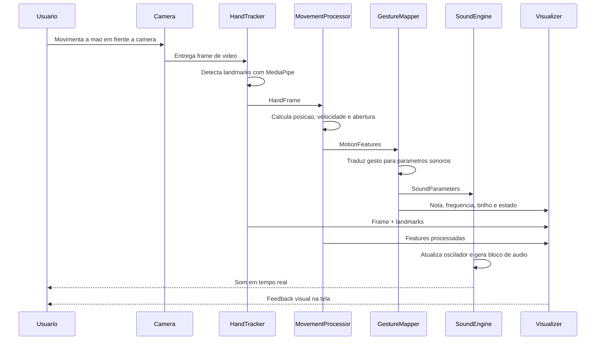
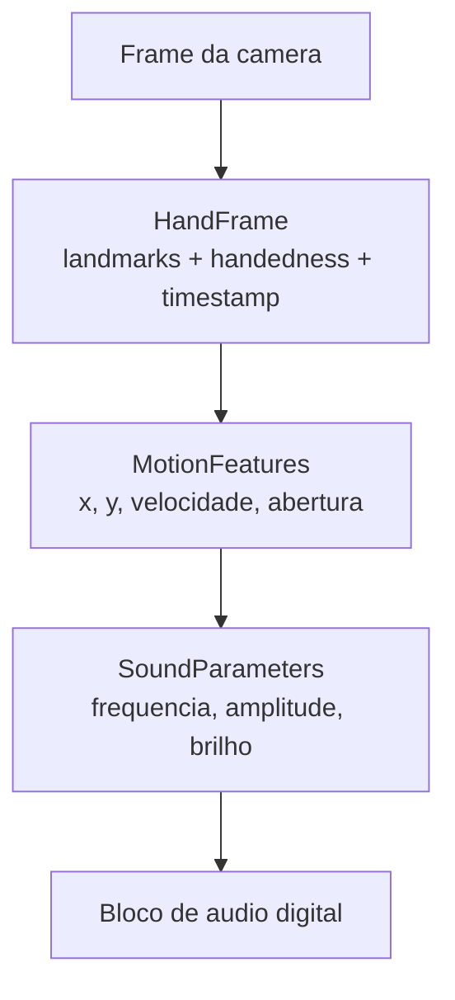

# Arquitetura Do Sistema

Este documento descreve a arquitetura atual do `MoveCodeBeats` em uma forma visual e textual. O objetivo e mostrar como o movimento capturado pela camera percorre cada camada do sistema ate resultar em audio em tempo real.

## Versao UML

Os diagramas UML em PlantUML estao em `docs/uml/`:

- `docs/uml/component-diagram.puml`
- `docs/uml/sequence-diagram.puml`
- `docs/uml/class-diagram.puml`

## Visao Geral Em Camadas

## Fluxo De Dados Em Tempo Real

## Papel De Cada Camada

- `main.py`: inicia o sistema, instancia os modulos, controla o loop principal e encerra os recursos corretamente.
- `capture/hand_tracker.py`: abre a camera, prepara o modelo do MediaPipe, detecta a mao e converte o resultado para a estrutura `HandFrame`.
- `processing/movement_processor.py`: transforma landmarks em features semanticas mais estaveis, como posicao suavizada, velocidade e abertura da mao.
- `mapping/gesture_mapper.py`: traduz essas features em parametros musicais e acusticos, como nota, frequencia, amplitude e brilho.
- `sound/sound_engine.py`: recebe os parametros sonoros e mantem um sintetizador digital continuo, responsavel pela geracao do audio.
- `utils/visualizer.py`: desenha a malha da mao, os indices dos landmarks e os valores principais do sistema para depuracao e demonstracao.
- `utils/config.py`: centraliza os parametros configuraveis do sistema.
- `utils/models.py`: define as estruturas de dados trocadas entre as camadas.
- `tests/test_pipeline.py`: valida partes importantes da logica sem depender de camera ou audio reais.

## Estruturas De Dados Que Interligam O Sistema

## Justificativa Arquitetural

- A separacao em camadas reduz acoplamento e facilita manutencao.
- O uso de estruturas de dados intermediarias torna o fluxo claro e testavel.
- A sintese local em tempo real permite validar rapidamente a relacao entre gesto e som.
- A arquitetura ja prepara o caminho para uma etapa futura de integracao com Strudel, SuperCollider ou outro ambiente de live coding.
