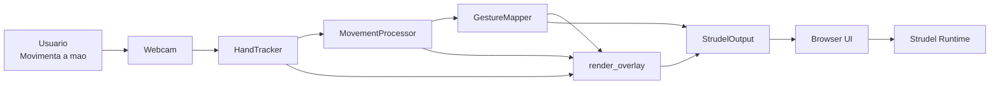
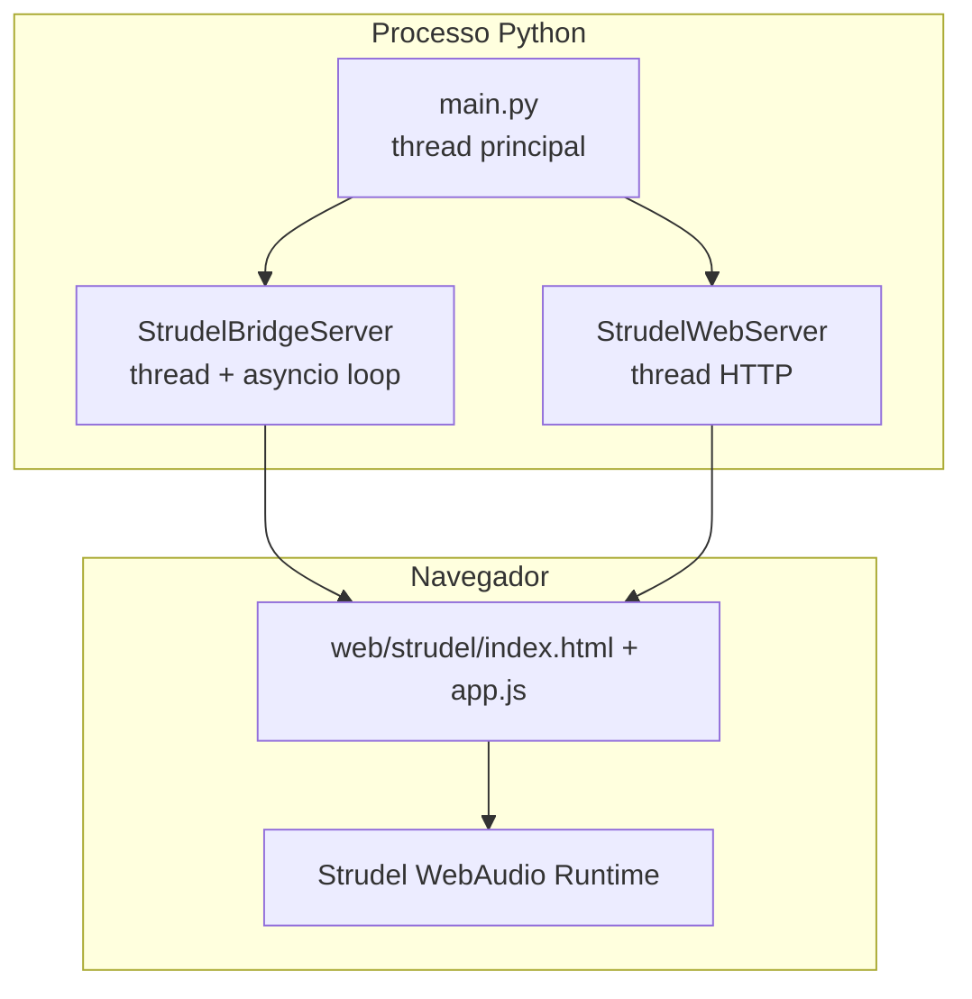

# MoveCodeBeats - Documento Tecnico Da Implementacao Legada

> Este documento descreve a implementacao browser-first anterior a migracao
> FastAPI + React. Ele foi preservado como registro historico do prototipo.
> Para a arquitetura atual, consulte `docs/architecture.md`, `README.md`,
> `contracts/README.md` e `docs/adr/0001-fastapi-react-boundary.md`.

## 1. Objetivo Deste Documento

Este documento descreve a implementacao atual do `MoveCodeBeats` com nivel maximo de detalhe tecnico. O foco e explicar:

- o papel de cada arquivo relevante;
- a topologia de execucao do sistema;
- as bibliotecas utilizadas e como elas interagem;
- os contratos de dados entre as camadas;
- os calculos numericos e as formulas de mapeamento;
- a integracao exata entre Python, WebSocket, navegador e Strudel;
- os artefatos visuais existentes no projeto;
- os testes que validam a implementacao.

O documento descreve a versao atual do prototipo, isto e, a versao `browser-first`, sem sintetizador local em Python. O som agora e produzido no navegador pelo runtime do Strudel, enquanto o backend Python e responsavel por:

1. capturar a imagem da camera;
2. detectar a mao com MediaPipe;
3. extrair features de movimento;
4. mapear essas features para parametros musicais;
5. desenhar o overlay visual;
6. publicar o estado musical e o preview visual via HTTP + WebSocket.

---

## 1.1 Atualizacao: perfis expressivos e cenas multicamada

A implementacao atual possui uma camada de `EmotionProfile` em
`integration/strudel/presets.py`. Ela representa quatro categorias expressivas
simuladas: `neutral`, `joy`, `sadness` e `anger`.

Cada perfil define parametros configuraveis e aponta para uma `SceneRecipe`:

- BPM e densidade;
- intensidade e faixa permitida de gain;
- faixa de LPF;
- familia de synths;
- conjunto sugerido de notas;
- multiplos patterns ritmicos;
- nivel de variacao;
- tempo de transicao previsto.

`integration/strudel/scenes.py` define a orquestracao de cada categoria por
meio de `SceneRecipe`, `LayerRecipe` e `GestureRecipe`. As cenas atuais usam:

- Neutro: melodia, baixo e bateria regulares;
- Alegria: melodia palindromica, harmonia maior, baixo euclidiano, bateria e textura aguda;
- Tristeza: melodia longa, harmonia menor, baixo lento, percussao esparsa e textura ambiente;
- Raiva: repeticoes densas, baixo euclidiano, bateria agressiva e camada aguda distorcida.

O arranjo e montado com `stack(...)`. O BPM e convertido para ciclos por minuto
com `setcpm(bpm / beats_per_cycle)`, enquanto `density` continua controlando a
quantidade temporal de eventos com `fast(density)`. Assim, tempo musical e
densidade deixam de ser tratados como se fossem o mesmo parametro.

A interface envia `emotion/select` pelo WebSocket. O backend resolve o perfil,
combina seus limites com os parametros gestuais e devolve um `StrudelState`
enriquecido. Nesta etapa:

```text
emotion_source = "manual"
emotion_confidence = 1.0
```

Isso simula o contrato da futura classificacao automatica. Nao existe dataset
ou classificador em execucao, e o sistema nao afirma reconhecer emocoes internas
reais. A formulacao correta e reconhecimento futuro de padroes corporais
associados a categorias expressivas representadas.

O contrato preserva os campos legados `selected_preset` e `preset_*`, permitindo
uma migracao incremental da primeira camada de presets.

---

## 2. Snapshot Tecnologico Atual

### 2.1 Linguagem principal

- `Python 3.14.0`

### 2.2 Dependencias Python declaradas

- `mediapipe==0.10.33`
- `numpy==2.4.4`
- `opencv-contrib-python==4.13.0.92`
- `websockets==15.0.1`

### 2.3 Dependencias JavaScript / navegador

- `@strudel/web@1.3.0` carregado por CDN em `web/strudel/index.html`
- Dirt Samples carregado por `samples("github:tidalcycles/dirt-samples")`
- APIs nativas do navegador:
  - `WebSocket`
  - `fetch`
  - DOM API
  - `HTMLImageElement`
  - WebAudio, indiretamente, por meio do runtime do Strudel

### 2.4 Bibliotecas da standard library do Python utilizadas

- `dataclasses`
- `pathlib`
- `time`
- `urllib.request`
- `math`
- `re`
- `asyncio`
- `json`
- `threading`
- `typing`
- `functools`
- `http.server`
- `http`
- `urllib.parse`
- `base64`
- `webbrowser`
- `unittest`

---

## 3. Artefatos Do Projeto

### 3.1 Artefatos de codigo

- `main.py`
- `capture/hand_tracker.py`
- `processing/movement_processor.py`
- `mapping/gesture_mapper.py`
- `utils/config.py`
- `utils/models.py`
- `utils/visualizer.py`
- `integration/strudel/models.py`
- `integration/strudel/scenes.py`
- `integration/strudel/note_adapter.py`
- `integration/strudel/publisher.py`
- `integration/strudel/preview_publisher.py`
- `integration/strudel/bridge_server.py`
- `integration/strudel/web_server.py`
- `integration/strudel/output.py`
- `web/strudel/index.html`
- `web/strudel/app.js`
- `web/strudel/style.css`
- `tests/test_pipeline.py`
- `tests/test_strudel_integration.py`

### 3.2 Artefatos de diagrama

#### Fontes UML em PlantUML

- `docs/uml/component-diagram.puml`
- `docs/uml/sequence-diagram.puml`
- `docs/uml/class-diagram.puml`

#### Renderizacoes PNG atualizadas

- `docs/uml/component-diagram.png`
- `docs/uml/sequence-diagram.png`
- `docs/uml/class-diagram.png`

### 3.3 Outros artefatos relevantes

- `models/hand_landmarker.task`
  - modelo do MediaPipe Tasks usado para deteccao/rastreamento da mao.

---

## 4. Arquitetura Atual Em Alto Nivel

O sistema atual possui uma arquitetura em camadas com separacao clara entre:

1. captura;
2. processamento semantico;
3. mapeamento musical;
4. visualizacao;
5. integracao de saida para navegador/Strudel.

### 4.1 Diagrama Geral Em Mermaid



### 4.2 Diagrama De Topologia De Execucao



### 4.3 Consequencia arquitetural mais importante

A implementacao atual usa o Python como:

- camada de captura e analise gestual;
- gerador de estado musical;
- servidor local de interface;
- publicador de preview visual e parametros musicais.

O Python nao sintetiza mais audio. O audio pertence ao navegador, via Strudel.

---

## 5. Ciclo Completo De Execucao

## 5.1 Startup

Quando `main.py` e executado:

1. `load_config()` cria um `AppConfig`;
2. `HandTracker` tenta abrir a camera e carregar o modelo do MediaPipe;
3. `MovementProcessor` e instanciado;
4. `GestureMapper` e instanciado;
5. `StrudelOutput` e instanciado;
6. `StrudelOutput.start()` sobe:
   - um servidor WebSocket;
   - um servidor HTTP para a UI;
7. o terminal imprime a URL local;
8. inicia o loop infinito de captura e publicacao.

## 5.2 Loop principal

Em cada iteracao:

1. `tracker.read()` captura um frame da camera e tenta detectar ate duas maos;
2. `processor.process(hands_frame)` transforma landmarks em features numericas;
3. `mapper.map(motion)` converte features em parametros sonoros;
4. `render_overlay(...)` desenha landmarks, indices e a identificacao das maos;
5. `strudel_output.publish_state(motion, sound_params)` envia o estado musical enriquecido com o papel das duas maos;
6. `strudel_output.publish_preview(overlay)` envia um preview JPEG do frame anotado.

## 5.3 Encerramento

O encerramento normal acontece por `KeyboardInterrupt` (`Ctrl+C`):

1. o `except KeyboardInterrupt` registra o encerramento;
2. o bloco `finally` fecha a camera;
3. o bloco `finally` encerra o servidor HTTP e o servidor WebSocket.

---

## 6. Detalhamento Arquivo A Arquivo

## 6.1 `main.py`

### 6.1.1 Papel

`main.py` e o orquestrador central. Ele nao implementa deteccao, processamento, mapeamento, interface web ou Strudel em si. Ele apenas:

- instancia os modulos;
- define a ordem de chamada;
- controla o loop;
- garante o encerramento correto.

### 6.1.2 Dependencias importadas

- `HandTracker`
- `StrudelOutput`
- `GestureMapper`
- `MovementProcessor`
- `load_config`
- `render_overlay`

### 6.1.3 Detalhes de controle

- Se a camera falha na inicializacao, o programa termina com codigo `1`.
- Se `StrudelOutput` estiver desabilitado em configuracao, a versao atual nao continua em modo degradado; ela encerra com erro, porque este prototipo agora depende da saida web como componente central.
- O loop principal nao possui `sleep()`. O ritmo de execucao e imposto por:
  - tempo de `cv2.VideoCapture.read()`;
  - tempo de inferencia do MediaPipe;
  - custo do processamento de movimento;
  - custo do mapeamento;
  - custo de desenho do overlay;
  - throttling de preview e de estado no `StrudelOutput`.

### 6.1.4 Implicacao

O `main.py` funciona como um scheduler simples de tempo real, porem sem fila, sem buffer historico e sem processamento em batch.

---

## 6.2 `utils/config.py`

### 6.2.1 Papel

Centralizar todos os parametros configuraveis do sistema.

### 6.2.2 `PROJECT_ROOT`

```python
PROJECT_ROOT = Path(__file__).resolve().parent.parent
```

Esse valor define a raiz logica do projeto e e utilizado para localizar:

- `models/hand_landmarker.task`
- `web/strudel/`

### 6.2.3 `CameraConfig`

Campos:

- `device_index=0`
  - usa a camera padrao do sistema.
- `frame_width=1280`
- `frame_height=720`
  - resolucao alvo da captura.
- `mirror_feed=True`
  - espelha horizontalmente o video.
- `max_num_hands=2`
  - permite inferencia de ate duas maos no mesmo frame.
- `min_detection_confidence=0.65`
- `min_presence_confidence=0.5`
- `min_tracking_confidence=0.55`
  - limiares do MediaPipe.
- `model_path`
  - caminho local para o arquivo `.task`.
- `model_url`
  - URL de download do modelo oficial.

### 6.2.4 `ProcessingConfig`

- `position_smoothing=0.3`
- `velocity_smoothing=0.25`
- `openness_smoothing=0.2`
- `velocity_reference=1.3`
- `hand_span_reference=2.2`
- `primary_handedness="right"`

Interpretacao:

- os tres primeiros valores sao fatores `alpha` para media exponencial;
- `velocity_reference` define a velocidade considerada suficiente para normalizar o valor perto de `1`;
- `hand_span_reference` regula a abertura normalizada da mao;
- `primary_handedness` define a mao preferencial para controle quando duas maos sao detectadas e nao existe ainda uma mao ativa persistida.

### 6.2.5 `MappingConfig`

- `root_midi=48` -> `C3`
- `octaves=3`
- `scale_intervals=(0, 3, 5, 7, 10)` -> pentatonica menor
- `min_amplitude=0.08`
- `max_amplitude=0.65`
- `velocity_weight=0.6`
- `openness_weight=0.4`
- `default_synth_name="sawtooth"`
- `secondary_synths=("sine", "triangle", "sawtooth", "square")`

### 6.2.6 `StrudelConfig`

Campos de transporte:

- `enabled=True`
- `ws_host="127.0.0.1"`
- `ws_port=8765`
- `http_host="127.0.0.1"`
- `http_port=8080`
- `port_search_span=20`

Campos de publicacao do estado musical:

- `update_hz=8`
- `note_change_immediate=True`
- `gain_precision=3`
- `gain_delta=0.03`
- `brightness_delta=0.05`
- `send_inactive_state=True`

Campos de publicacao do preview:

- `preview_update_hz=12`
- `preview_jpeg_quality=72`
- `preview_max_width=960`

Campo utilitario:

- `auto_open_browser=False`

Observacao:

- se as portas preferenciais estiverem ocupadas ou bloqueadas, os servidores HTTP e WebSocket tentam automaticamente as portas seguintes dentro da faixa definida por `port_search_span`.

### 6.2.7 `AppConfig`

Agrega:

- `camera`
- `processing`
- `mapping`
- `strudel`

### 6.2.8 `load_config()`

Atualmente:

```python
def load_config() -> AppConfig:
    return AppConfig()
```

Isto significa que:

- nao ha parsing de `.env`, `json`, `yaml` ou CLI;
- a configuracao atual e puramente in-code;
- reproducibilidade depende do versionamento do repositorio.

---

## 6.3 `utils/models.py`

### 6.3.1 Papel

Definir os contratos estruturais de dados do backend.

### 6.3.2 `Landmark`

Representa um ponto 3D detectado:

- `x`
- `y`
- `z`

`frozen=True` significa:

- o objeto e imutavel depois de criado;
- isso reduz risco de mutacao acidental.

### 6.3.3 `HandFrame`

Representa a mao detectada em um instante:

- `landmarks: list[Landmark]`
- `handedness: str`
- `timestamp: float`

Observacao importante:

- `HandFrame` continua sendo a estrutura de uma mao individual.
- a expansao para duas maos adiciona um contêiner acima dele, `HandsFrame`, em vez de alterar o significado de `HandFrame`.

### 6.3.4 `HandsFrame`

Representa o conjunto de maos detectadas no mesmo frame:

- `hands: list[HandFrame]`
- `timestamp: float`

Metodos e propriedades relevantes:

- `count`
- `handedness_labels`
- `get_hand(handedness)`
- `select_primary(preferred_handedness=None)`

`select_primary(...)` aplica a regra atual de selecao:

1. tenta a mao preferida informada;
2. se nao existir, tenta `"right"`;
3. se nao existir, tenta `"left"`;
4. se ainda assim nao houver correspondencia, usa a primeira mao disponivel.

### 6.3.5 `HandMotion`

Representa uma mao isolada ja traduzida em variaveis semanticas:

- `raw_x`
- `raw_y`
- `x`
- `y`
- `velocity`
- `openness`
- `handedness`
- `active`

Observacao importante:

- `raw_x` e `raw_y` sao os valores brutos clamped;
- `x` e `y` sao os valores suavizados;
- `velocity` e `openness` pertencem a essa mao especifica, nao ao frame inteiro.

### 6.3.6 `MotionFeatures`

Representa o estado combinado do frame atual:

- `primary: HandMotion`
- `secondary: HandMotion`
- `hands_detected: int`

Propriedades derivadas:

- `active` -> espelha `primary.active`
- `x`, `y`, `velocity`, `openness`, `handedness` -> atalhos para a mao primaria
- `has_secondary` -> indica se ha uma mao secundaria util no frame
- `secondary_handedness` -> handedness da mao secundaria

### 6.3.7 `ScaleNote`

Representa uma nota precomputada da escala:

- `midi`
- `label`
- `frequency`

### 6.3.8 `SoundParameters`

Representa o estado musical calculado pelo mapper:

- `frequency`
- `amplitude`
- `brightness`
- `note_label`
- `synth_name`
- `active`

Observacao importante:

- `SoundParameters.frequency` ainda existe e e calculado com precisao, embora o frontend atual do Strudel execute pela nota (`note(...)`) e nao por `freq(...)`.
- Portanto, `frequency` hoje e usada principalmente para observabilidade, depuracao e extensao futura.
- `synth_name` permite que a mao secundaria escolha explicitamente qual synth do Strudel sera usado na execucao.

---

## 6.4 `capture/hand_tracker.py`

### 6.4.1 Papel

Camada de aquisicao e inferencia visual.

### 6.4.2 Bibliotecas utilizadas

- `cv2`
- `mediapipe as mp`
- `urllib.request`
- `time`

### 6.4.3 Inicializacao

No construtor:

1. guarda a configuracao;
2. abre a camera com `_open_capture`;
3. configura largura e altura;
4. cria o detector de mao com `_create_landmarker`.

### 6.4.4 Selecao da camera

`_open_capture()` tenta:

1. `cv2.CAP_DSHOW` quando disponivel;
2. se falhar, `cv2.VideoCapture(device_index)` padrao.

Motivo:

- em Windows, `CAP_DSHOW` frequentemente reduz problemas de inicializacao.

### 6.4.5 Pipeline de leitura

`read()` faz:

1. `self._capture.read()`
2. valida `ok` e `frame`
3. aplica espelhamento se `mirror_feed=True`
4. converte `BGR -> RGB`
5. encapsula o frame em `mp.Image`
6. gera `timestamp_ms = int(time.perf_counter() * 1000)`
7. chama `detect_for_video`
8. converte a resposta para `HandsFrame`

### 6.4.6 Por que `time.perf_counter()`?

Porque:

- e monotonicamente crescente;
- e apropriado para intervalos e medições temporais;
- evita problemas de ajuste de relogio do sistema.

### 6.4.7 Modelo do MediaPipe

`_create_landmarker()` usa:

- `mp.tasks.BaseOptions(model_asset_path=...)`
- `mp.tasks.vision.HandLandmarkerOptions(...)`
- `mp.tasks.vision.RunningMode.VIDEO`

`VIDEO` e importante porque:

- o MediaPipe passa a considerar o fluxo temporal;
- isso e mais apropriado para webcam do que `IMAGE`.

### 6.4.8 Extração de dados da mao

`_extract_hand(result)`:

- le `result.hand_landmarks`;
- usa apenas a primeira mao detectada;
- converte cada ponto em `Landmark`;
- extrai `handedness` de `result.handedness`;
- carimba `timestamp=time.perf_counter()`.

### 6.4.9 Download do modelo

`_ensure_model_file()`:

- verifica se `model_path` existe;
- se nao existir, cria a pasta;
- tenta baixar via `urllib.request.urlretrieve`;
- em caso de falha, levanta `RuntimeError` com orientacao manual.

### 6.4.10 Limitacoes da implementacao

- somente a primeira mao e usada;
- nao ha reconexao automatica da camera se ela falhar no meio da execucao;
- nao ha selecao de camera por UI;
- o frame retornado e o frame BGR espelhado, nao um RGB pronto para web.

---

## 6.5 `processing/movement_processor.py`

### 6.5.1 Papel

Transformar landmarks crus em features dinamicas e relativamente estaveis.

### 6.5.2 Estado interno

O processador e stateful. Ele guarda:

- `_prev_raw_x`
- `_prev_raw_y`
- `_prev_timestamp`
- `_smoothed_x`
- `_smoothed_y`
- `_smoothed_velocity`
- `_smoothed_openness`

Sem esse estado:

- nao seria possivel calcular velocidade temporal;
- nao seria possivel aplicar suavizacao exponencial.

### 6.5.3 Landmarks utilizados

- `8` -> ponta do indicador
- `4` -> ponta do polegar
- `0` -> punho
- `9` -> base do dedo medio (`middle_mcp`)

### 6.5.4 Calculo de posicao

```python
raw_x = _clamp(index_tip.x)
raw_y = _clamp(index_tip.y)
```

Como o MediaPipe usa coordenadas normalizadas:

- `x=0` = esquerda;
- `x=1` = direita;
- `y=0` = topo;
- `y=1` = base.

### 6.5.5 Calculo de velocidade

Se nao houver frame anterior, a velocidade e `0.0`.

Se houver:

```text
delta_t = max(timestamp_atual - timestamp_anterior, 1e-3)
delta_pos = distancia_euclidiana((x_atual, y_atual), (x_anterior, y_anterior))
velocity = delta_pos / delta_t
velocity_normalizada = clamp(velocity / velocity_reference)
```

Formula expandida:

```text
delta_pos = sqrt((x2 - x1)^2 + (y2 - y1)^2)
velocity = delta_pos / delta_t
velocity_normalizada = clamp(velocity / 1.3)
```

O `1e-3` evita divisao por zero.

### 6.5.6 Calculo de escala aproximada da mao

```text
hand_scale = max(dist(wrist, middle_mcp), 1e-4)
```

Objetivo:

- impedir que a abertura dependa apenas da distancia absoluta na imagem;
- aproximar uma normalizacao pelo tamanho da mao.

### 6.5.7 Calculo de abertura

```text
raw_openness = clamp(
    dist(thumb_tip, index_tip) / (hand_scale * hand_span_reference)
)
```

Com a configuracao atual:

```text
raw_openness = clamp(
    dist(thumb_tip, index_tip) / (hand_scale * 2.2)
)
```

### 6.5.8 Suavizacao

Funcao:

```python
def _smooth(value, previous, alpha):
    if previous is None:
        return value
    return previous + alpha * (value - previous)
```

Isto e uma forma de media movel exponencial discreta.

Equacao:

```text
valor_suavizado_novo = valor_anterior + alpha * (valor_bruto - valor_anterior)
```

Parametros atuais:

- posicao: `alpha = 0.3`
- velocidade: `alpha = 0.25`
- abertura: `alpha = 0.2`

Interpretacao:

- alpha menor -> mais estabilidade, menos responsividade;
- alpha maior -> mais responsividade, menos estabilidade.

### 6.5.9 Reset sem mao

Quando `hand_frame is None`:

- o estado interno e zerado;
- `MotionFeatures()` padrao e retornado;
- `active=False`.

Isto evita “memoria fantasma” quando a mao sai do quadro.

---

## 6.6 `mapping/gesture_mapper.py`

### 6.6.1 Papel

Transformar `MotionFeatures` em `SoundParameters`.

### 6.6.2 Constante de nomes musicais

O modulo define:

- `NOTE_NAMES`

`NOTE_NAMES` converte o resto da divisao do MIDI por 12 no nome ocidental da
nota. A antiga constante `STRUDEL_NOTES`, que nao participava do fluxo, foi
removida; a conversao para a sintaxe do Strudel pertence exclusivamente a
`integration/strudel/note_adapter.py`.

### 6.6.3 Escala musical

Configuracao:

- `root_midi=48`
- `octaves=3`
- `scale_intervals=(0, 3, 5, 7, 10)`

Isto gera 15 notas:

| Indice | Nota | Frequencia (Hz) |
|---|---|---:|
| 0 | C3 | 130.8128 |
| 1 | D#3 | 155.5635 |
| 2 | F3 | 174.6141 |
| 3 | G3 | 195.9977 |
| 4 | A#3 | 233.0819 |
| 5 | C4 | 261.6256 |
| 6 | D#4 | 311.1270 |
| 7 | F4 | 349.2282 |
| 8 | G4 | 391.9954 |
| 9 | A#4 | 466.1638 |
| 10 | C5 | 523.2511 |
| 11 | D#5 | 622.2540 |
| 12 | F5 | 698.4565 |
| 13 | G5 | 783.9909 |
| 14 | A#5 | 932.3275 |

### 6.6.4 Formula MIDI -> frequencia

```text
frequency = 440 * 2^((midi - 69)/12)
```

### 6.6.5 Formula MIDI -> label

```text
note_name = NOTE_NAMES[midi % 12]
octave = (midi // 12) - 1
label = f"{note_name}{octave}"
```

### 6.6.6 Mapeamento da posicao horizontal para nota

```text
note_index = round(motion.x * (len(scale) - 1))
```

Como `len(scale)=15`, então:

```text
note_index = round(motion.x * 14)
```

Consequencia:

- `x=0.0` -> indice 0 -> `C3`
- `x=1.0` -> indice 14 -> `A#5`

### 6.6.7 Mapeamento da posicao vertical para amplitude

```text
amplitude_span = max_amplitude - min_amplitude
amplitude = min_amplitude + (1 - motion.y) * amplitude_span
```

Com valores atuais:

```text
amplitude = 0.08 + (1 - y) * (0.65 - 0.08)
amplitude = 0.08 + (1 - y) * 0.57
```

Interpretacao:

- mao mais alta (`y` menor) -> gain maior;
- mao mais baixa (`y` maior) -> gain menor.

### 6.6.8 Mapeamento da mao secundaria para brilho

Na implementacao atual, o brilho usa a mao secundaria quando ela esta presente. Caso contrario, faz fallback para a mao primaria.

```text
modulator = motion.secondary, se motion.secondary.active
modulator = motion.primary, caso contrario

brightness = clamp(
    modulator.velocity * velocity_weight +
    modulator.openness * openness_weight
)
```

Com valores atuais:

```text
brightness = clamp(
    modulator.velocity * 0.6 +
    modulator.openness * 0.4
)
```

### 6.6.9 Mapeamento da mao secundaria para synth

Se a mao secundaria estiver ativa, sua posicao horizontal define o synth do Strudel:

```text
synth_index = round(motion.secondary.x * (len(secondary_synths) - 1))
synth = secondary_synths[synth_index]
```

Com os defaults atuais:

```text
secondary_synths = ("sine", "triangle", "sawtooth", "square")
```

Portanto:

- mais a esquerda -> `sine`
- meio-esquerda -> `triangle`
- meio-direita -> `sawtooth`
- mais a direita -> `square`

Se nao houver mao secundaria:

```text
synth = default_synth_name = "sawtooth"
```

### 6.6.10 Estado sem mao

Se `motion.active == False`, o mapper retorna:

- `frequency=0.0`
- `amplitude=0.0`
- `brightness=0.0`
- `note_label="--"`
- `active=False`

---

## 6.7 `utils/visualizer.py`

### 6.7.1 Papel

Gerar a camada de overlay visual que sera enviada ao navegador.

### 6.7.2 `HAND_CONNECTIONS`

Tupla com os pares de indices conectados:

- polegar
- indicador
- medio
- anelar
- minimo
- conexoes da palma

### 6.7.3 `render_overlay()`

Passos:

1. clona o frame (`frame.copy()`);
2. calcula `frame_height` e `frame_width`;
3. normaliza o frame de uma ou duas maos para uma lista;
4. chama `_draw_hand()` para cada mao detectada;
5. retorna a imagem anotada sem bloco textual de parametros.

### 6.7.4 Desenho dos landmarks

Para cada landmark:

- converte coordenadas normalizadas em pixels;
- desenha as linhas da malha com `cv2.line`;
- desenha circulos com `cv2.circle`;
- escreve o indice com duas chamadas `cv2.putText`:
  - uma escura grossa como contorno;
  - uma branca fina por cima.

### 6.7.5 Destaques visuais

- landmark `8` (indicador) recebe cor diferenciada;
- landmarks `4` e `8` recebem raio maior.

### 6.7.7 Observacao

O overlay e o proprio artefato visual principal do backend. O frontend apenas o exibe; ele nao redesenha landmarks por conta propria.

---

## 6.8 `integration/strudel/models.py`

### 6.8.1 `StrudelState`

Campos:

- `active`
- `note_label`
- `strudel_note`
- `frequency`
- `gain`
- `brightness`
- `lpf`
- `synth`
- `hands_detected`
- `primary_handedness`
- `secondary_handedness`
- `brightness_source`
- `code`
- `timestamp`

Metodo:

```python
to_payload()
```

Ele transforma a dataclass em `dict` via `asdict` e acrescenta:

```python
payload["type"] = "state"
```

### 6.8.2 `PreviewFrame`

Campos:

- `image`
- `width`
- `height`
- `timestamp`

Metodo:

```python
to_payload()
```

que adiciona:

```python
payload["type"] = "frame"
```

### 6.8.3 Significado dos dois payloads

O canal WebSocket e multiplexado semanticamente:

- mensagens de tipo `state` atualizam o motor musical e o painel textual;
- mensagens de tipo `frame` atualizam o preview visual.

---

## 6.9 `integration/strudel/note_adapter.py`

### 6.9.1 Papel

Converter labels de nota do backend Python para o token textual esperado pela API de `note(...)` do Strudel.

### 6.9.2 Estrategia

Exemplos:

- `A#4` -> `a#4`
- `C3` -> `c3`
- `Bb4` -> `bb4`

### 6.9.3 Regex

```python
NOTE_PATTERN = re.compile(r"([A-G])([#b]?)(-?\d+)")
```

Partes:

- grupo 1 -> letra base
- grupo 2 -> acidente opcional
- grupo 3 -> oitava, inclusive negativa se necessario

### 6.9.4 Notas inativas

Se `note_label` estiver em `{ "", "--", "~" }`, retorna `"~"`.

No contexto do projeto:

- `"--"` = sem nota valida no backend;
- `"~"` = repouso/ausencia no dominio Strudel.

### 6.9.5 Observacao

O adapter aceita sustenidos e bemois, mas o mapper atual do backend emite sustenidos, porque `NOTE_NAMES` usa `C#`, `D#`, `F#`, `G#`, `A#`.

---

## 6.10 Geracao Strudel No Frontend

### 6.10.1 Papel

O codigo Strudel equivalente nao e mais gerado no Python. O backend envia um
estado estruturado com perfil, cena, camadas, gesto, nota, gain, LPF e synth. O
frontend usa `buildPatternExpression(...)` para gerar duas saidas a partir da
mesma arvore de construcao:

- `expression.value`: objeto Pattern executado por `strudelRepl.setPattern(...)`;
- `expression.code`: representacao textual exibida em `<pre id="code-view">`.

### 6.10.2 Regras

Se `state.active == False`, o texto exibido e:

```text
hush()
```

Se `state.active == True`, o construtor do frontend monta:

```text
setcpm(profile_bpm / scene_beats_per_cycle);

stack(
  camada_melodica,
  camada_harmonica,
  camada_de_baixo,
  camada_percussiva,
  camada_de_textura
)
```

Cada camada aplica apenas os recursos declarados em sua `LayerRecipe`, incluindo
offset de nota, intervalos, gain relativo, LPF, HPF, ataque, release, room,
delay, shape, distort, crush, panorama, velocidade, lentidao e ritmo euclidiano.

Depois de `stack(...)`, a cena aplica `master_gain`. Esse parametro nao substitui
o gain gestual: ele atua sobre a soma final para compensar a atenuacao causada
pelos ganhos relativos de cada camada. Os valores atuais sao:

- Neutro: `1.55`;
- Alegria: `1.45`;
- Tristeza: `1.75`;
- Raiva: `1.25`.

Raiva recebe menor reforco porque suas camadas usam `shape`, `distort` e maior
densidade, apresentando mais energia e risco de saturacao.

O `GestureRecipe` define respostas diferentes por perfil. Por exemplo, `hold`
adiciona um brilho agudo em Alegria, um drone lento em Tristeza e uma camada de
pressao distorcida em Raiva.

O ponto e virgula depois de `setcpm(...)` e obrigatorio neste codigo exportado.
Como o pattern seguinte comeca por parenteses, sua ausencia permite que o
JavaScript interprete o trecho como `setcpm(...)(pattern)`, resultando em
`setcpm(...) is not a function`. A funcao continua disponivel no Strudel atual;
o erro anterior era de separacao entre as duas expressoes.

### 6.10.3 Observacao

Esse codigo e exibido ao usuario e tambem serve como referencia conceitual. Entretanto, o frontend atual nao executa essa string por `eval`; ele reconstrui a pattern por API JS a partir do JSON estruturado.

---

## 6.11 `integration/strudel/publisher.py`

### 6.11.1 Papel

Converter `SoundParameters` em `StrudelState` e controlar quando um novo estado deve ser publicado.

### 6.11.2 `build_state()`

Regras:

```text
active = params.active
note_label = params.note_label se ativo; caso contrario "--"
strudel_note = to_strudel_note(note_label)
gain = clamp(params.amplitude * profile.intensity, profile.gain_range)
brightness = round(params.brightness, 3) se ativo; caso contrario 0.0
lpf = round(
    profile.lpf_range[0]
    + brightness * (profile.lpf_range[1] - profile.lpf_range[0])
)
frequency = params.frequency se ativo; caso contrario 0.0
synth = params.synth_name com mao secundaria; caso contrario profile.default_synth
timestamp = time.time()
code = ""  # campo legado; o codigo executavel agora e derivado no frontend
```

### 6.11.3 Formula do LPF

```text
lpf = round(profile_lpf_min + brightness * (profile_lpf_max - profile_lpf_min))
```

Exemplo para o perfil Alegria, cuja faixa e `1600..7000`:

- `brightness = 0.20`
- `lpf = round(1600 + 0.20 * (7000 - 1600))`
- `lpf = round(2680)`
- `lpf = 2680`

### 6.11.4 Politica de publicacao

`should_publish()` envia imediatamente se:

1. nao houver estado anterior;
2. `active` mudou;
3. a nota mudou e `note_change_immediate=True`;
4. `gain_delta >= gain_delta_config`;
5. `brightness_delta >= brightness_delta_config`;
6. ja passou `1/update_hz` segundos desde o ultimo envio.

Com a configuracao atual:

- `update_hz=8` -> intervalo minimo de `0.125s`
- `gain_delta=0.03`
- `brightness_delta=0.05`

### 6.11.5 Proposito dessa politica

Evitar flood do WebSocket com uma mensagem a cada frame.

Sem isso:

- o navegador receberia atualizacoes excessivas;
- o `hush() + play()` do frontend seria disparado em excesso;
- a experiencia sonora ficaria mais instavel.

---

## 6.12 `integration/strudel/preview_publisher.py`

### 6.12.1 Papel

Preparar o overlay visual para transporte eficiente ao navegador.

### 6.12.2 `should_publish()`

Usa:

```text
interval = 1 / preview_update_hz
```

Com o default:

```text
interval = 1 / 12 = 0.083333...
```

Se menos tempo que isso tiver passado, o preview nao e reenviado.

### 6.12.3 `build_frame()`

Passos:

1. redimensiona se necessario;
2. codifica como JPEG com `cv2.imencode`;
3. converte bytes para Base64;
4. prefixa com `data:image/jpeg;base64,`;
5. retorna `PreviewFrame`.

### 6.12.4 Redimensionamento

Se `width <= preview_max_width`, nada e redimensionado.

Se `width > preview_max_width`:

```text
scale = preview_max_width / width
new_width = preview_max_width
new_height = round(height * scale)
```

Exemplo com a configuracao default:

- frame original: `1280x720`
- `preview_max_width = 960`
- `scale = 960/1280 = 0.75`
- preview: `960x540`

### 6.12.5 Qualidade JPEG

`preview_jpeg_quality=72`

Trade-off:

- qualidade visual intermediaria;
- payload menor do que JPEG de alta qualidade;
- adequado para loopback local.

### 6.12.6 Consequencia estrutural

O preview enviado ao browser nao e video bruto, nao e MJPEG streaming nativo e nao e canvas; e uma sequencia de imagens JPEG encapsuladas em payloads WebSocket.

---

## 6.13 `integration/strudel/bridge_server.py`

### 6.13.1 Papel

Servidor WebSocket assíncrono que difunde payloads para todos os clientes conectados.

### 6.13.2 Modelo de concorrencia

- thread dedicada: `strudel-websocket-server`
- dentro dela: um `asyncio` event loop

### 6.13.3 Estruturas de estado

- `_clients: set[Any]`
- `_loop`
- `_server_ready: threading.Event`
- `_stop_requested: threading.Event`
- `_thread`
- `_stop_event: asyncio.Event`

### 6.13.4 Startup

`start()`:

1. cria a thread daemon;
2. inicia a thread;
3. espera ate 5 segundos por `_server_ready`.

Se a espera exceder 5 segundos:

- `RuntimeError("Servidor WebSocket do Strudel nao iniciou a tempo.")`

### 6.13.5 Publicacao

`publish(payload)`:

1. serializa com `json.dumps`;
2. agenda `_broadcast(message)` no loop async com `asyncio.run_coroutine_threadsafe`;
3. espera `future.result(timeout=1)`.

Se falhar:

- o erro e suprimido;
- o prototipo continua.

### 6.13.6 Razao da tolerancia

A ausencia de navegador conectado nao deve matar a captura da camera nem o pipeline de mapeamento.

### 6.13.7 Clientes

`_handle_client()`:

- adiciona o cliente ao set;
- consome passivamente mensagens de entrada;
- descarta o cliente ao desconectar.

O protocolo atual e bidirecional:

- servidor -> cliente: estado musical e preview;
- cliente -> servidor: selecao manual do perfil expressivo.

O backend valida `emotion/select`, normaliza aliases e usa `neutral` como
fallback.

### 6.13.8 Broadcast

`_broadcast()`:

- percorre a copia do set de clientes;
- tenta `client.send(message)`;
- clientes que falham vao para `stale_clients`;
- depois sao removidos do set.

---

## 6.14 `integration/strudel/web_server.py`

### 6.14.1 Papel

Servidor HTTP local para a interface web.

### 6.14.2 Bibliotecas utilizadas

- `ThreadingHTTPServer`
- `SimpleHTTPRequestHandler`
- `functools.partial`
- `HTTPStatus`

### 6.14.3 Modelo

- thread dedicada `strudel-http-server`
- arquivos servidos a partir de `web/strudel/`

### 6.14.4 `base_url`

```python
return f"http://{self._host}:{self._port}"
```

### 6.14.5 Endpoint especial

`/config.json`

Resposta:

```json
{
  "wsUrl": "ws://127.0.0.1:8765"
}
```

Objetivo:

- desacoplar o frontend da configuracao hardcoded do WebSocket.

### 6.14.6 Silenciamento de logs

`log_message()` e sobrescrito para descartar mensagens do `SimpleHTTPRequestHandler`.

Objetivo:

- manter o terminal do backend mais limpo.

---

## 6.15 `integration/strudel/output.py`

### 6.15.1 Papel

Facade/orquestrador da camada de saida web.

Ele agrega:

- `StrudelPublisher`
- `PreviewPublisher`
- `StrudelBridgeServer`
- `StrudelWebServer`

### 6.15.2 `start()`

Ordem:

1. sobe o servidor WebSocket;
2. sobe o servidor HTTP;
3. opcionalmente abre o navegador.

Se qualquer erro ocorrer:

- `stop()` e chamado;
- `RuntimeError` e propagado.

### 6.15.3 `publish_state()`

1. valida `enabled`;
2. gera `StrudelState`;
3. respeita `send_inactive_state`;
4. respeita a politica de `should_publish`;
5. publica o payload `state`.

### 6.15.4 `publish_preview()`

1. valida `enabled`;
2. consulta `PreviewPublisher.should_publish()`;
3. gera `PreviewFrame`;
4. publica o payload `frame`.

### 6.15.5 `stop()`

Encerra:

1. servidor HTTP;
2. servidor WebSocket.

---

## 6.16 `web/strudel/index.html`

### 6.16.1 Papel

Definir a estrutura DOM da interface browser-first.

### 6.16.2 Dependencias front-end declaradas

- `style.css`
- `https://unpkg.com/@strudel/web@1.3.0`
- `app.js`

### 6.16.3 Estrutura principal

`<main class="layout">` contem:

1. `hero`
2. `workspace-grid`
3. `code-panel`

### 6.16.4 `hero`

Contem:

- nome do projeto;
- titulo da interface;
- descricao;
- botoes:
  - `Conectar`
  - `Ativar Audio`
  - `Parar`
- texto de status.

### 6.16.5 `workspace-grid`

Dividido em dois paines:

- `preview-panel`
- `state-panel`

### 6.16.6 `preview-panel`

Contem:

- cabecalho com badge `WebSocket`
- container `preview-frame`
- ``
- placeholder textual inicial

### 6.16.7 `state-panel`

Exibe:

- nota
- nota Strudel
- frequencia
- gain
- brilho
- LPF
- synth
- ativo/inativo

### 6.16.8 `code-panel`

Exibe o codigo Strudel equivalente dentro de `<pre id="code-view">`. Esse texto
e gerado por `buildPatternCode(state)`, que chama o mesmo
`buildPatternExpression(...)` usado para criar o Pattern executavel.

---

## 6.17 `web/strudel/app.js`

### 6.17.1 Papel

Cliente JavaScript que:

- conecta no WebSocket;
- recebe payloads do backend;
- atualiza a UI;
- controla o runtime do Strudel;
- toca ou silencia o som no navegador.

### 6.17.2 Estado global JS

- `runtimeReady`
- `socket`
- `wsUrl`
- `playbackArmed`
- `latestState`

### 6.17.3 Carregamento da configuracao

`loadConfig()` faz:

1. `fetch("./config.json")`
2. valida `response.ok`
3. parseia JSON
4. extrai `wsUrl`
5. atualiza `status`

### 6.17.4 Estado textual

`renderState(state)` aplica:

- `note_label`
- `strudel_note`
- `frequency.toFixed(1)`
- `gain.toFixed(3)`
- `brightness.toFixed(3)`
- `lpf`
- `synth`
- `active`

O campo legado `state.code` nao e mais usado pelo frontend.

### 6.17.5 Preview

`renderPreview(frame)`:

- troca `src` da imagem pelo `data:image/jpeg;base64,...`
- atualiza `width` e `height`
- exibe a imagem
- oculta o placeholder

### 6.17.6 Inicializacao do runtime Strudel

`ensureRuntime()`:

- valida que `initStrudel` existe;
- chama `initStrudel(...)` com uma funcao `prebake`;
- o `prebake` carrega `github:tidalcycles/dirt-samples`;
- guarda o objeto REPL retornado em `strudelRepl`;
- valida a existencia de `setPattern()` e `setCps()`;
- marca `runtimeReady=true`.

O carregamento explicito de samples e necessario porque `@strudel/web` nao
carrega bancos externos por padrao. Sem ele, as camadas sintetizadas funcionam,
mas eventos como `bd`, `sd`, `hh`, `cp`, `rim` e `oh` podem ficar silenciosos.

Uso de `Promise.resolve(...)` normaliza a inicializacao caso o retorno seja
sincrono ou assincrono.

### 6.17.7 Construcao da pattern

```javascript
const expression = buildPatternExpression(state, true);
codeView.textContent = expression.code;
await strudelRepl.setPattern(expression.value, true);
```

Observacao crucial:

- `buildPatternExpression(...)` e a fonte unica para o Pattern executavel e para
  o codigo textual exibido/copavel.
- `state.frequency` nao e usada aqui.
- O playback atual e baseado no token `note(...)`, nao em frequencia absoluta.
- A mao primaria continua definindo a nota e o gain de referencia.
- A mao secundaria continua definindo brilho e o synth da camada melodica.
- As demais camadas recebem ganhos relativos para evitar que todas tenham o mesmo peso.

### 6.17.8 Aplicacao do estado musical

`applyState(state)`:

1. guarda `latestState`;
2. atualiza os campos da UI;
3. se runtime nao estiver pronto ou o audio nao estiver armado, para ali;
4. se `active=false`, agenda uma parada tolerante a pequenas perdas de rastreio;
5. se `active=true`, solicita uma atualizacao coalescida por `requestPatternUpdate()`;
6. `flushPatternUpdates()` suaviza gain, LPF e brilho;
7. ajusta CPS apenas quando o BPM muda;
8. gera `expression = buildPatternExpression(state, true)`;
9. atualiza o painel de codigo com `expression.code`;
10. chama `strudelRepl.setPattern(expression.value, true)`.

### 6.17.9 Consequencia sonora importante

O frontend nao usa mais:

```text
hush() + nova pattern.play()
```

Esse fluxo reiniciava o scheduler a cada estado WebSocket e impedia que um
ciclo ritmico fosse completado. Como o backend pode publicar oito estados por
segundo, o pattern frequentemente voltava ao inicio antes de executar suas
batidas posteriores.

O fluxo atual usa:

```text
setPattern(novo_pattern, true)
```

Segundo o contrato do scheduler do Strudel, `setPattern` substitui a funcao
consultada para os proximos eventos. Quando o scheduler ja esta iniciado, seu
tempo nao e zerado. Isso preserva o ciclo e permite atualizar nota, gain, filtro,
synth e gesto em tempo real.

As atualizacoes sao coalescidas: se outro estado chegar enquanto uma troca esta
em andamento, apenas o estado mais recente precisa ser aplicado em seguida.

Para melhorar a continuidade perceptiva, existem dois intervalos:

- `PRIORITY_UPDATE_MS = 45` para mudancas estruturais;
- `CONTINUOUS_UPDATE_MS = 150` para modulacoes continuas.

O frontend gera uma chave estrutural com perfil, modo de pattern, fase/evento
gestual, direcao de sweep e synth. Mudancas nessa chave sao priorizadas. Nota,
gain, brilho e LPF seguem o fluxo continuo para evitar reconstrucoes excessivas
do pattern causadas por pequenas oscilacoes da camera.

Gain, brilho e LPF sao suavizados pela formula:

```text
alpha = 1 - exp(-delta_t / transition_seconds)
valor_suavizado = atual + (alvo - atual) * alpha
```

Essa formula torna a suavizacao dependente do tempo transcorrido e usa o
`transition_seconds` do perfil. Tristeza converge mais lentamente; Raiva e
Alegria respondem mais rapidamente.

Quando a mao desaparece, o frontend espera `360 ms` antes de parar o scheduler.
Se a deteccao retornar nesse intervalo, o corte e cancelado. Isso reduz
interrupcoes causadas por oclusao, motion blur ou perda de landmarks em um
numero pequeno de frames.

### Estabilizacao especifica da cena Raiva

Raiva utiliza uma taxa efetiva de atualizacao continua de `240 ms` e uma
tolerancia de rastreamento de `520 ms`. A mudanca de synth nessa cena nao entra
na chave de prioridade, evitando alternancias urgentes quando a mao secundaria
oscila perto da fronteira entre dois synths.

A densidade foi ajustada de `1.32` para `1.24`, e o modo basico deixou de
adicionar uma segunda aceleracao global. A identidade continua rapida por causa
do BPM 136, das subdivisoes internas e dos ritmos euclidianos.

Os releases foram ampliados:

- melodia: `0.18 s`;
- baixo: `0.24 s`;
- bateria: `0.16 s`;
- textura aguda: `0.14 s`;
- camada de hold: `0.18 s`.

Essas caudas criam sobreposicao curta entre eventos consecutivos. O objetivo e
remover microvazios e clicks perceptivos sem transformar a articulacao agressiva
em uma textura sustentada.

### 6.17.10 Dispatch de payloads

`handlePayload(payload)`:

- `type === "state"` -> `applyState(payload)`
- `type === "frame"` -> `renderPreview(payload)`

### 6.17.11 WebSocket

`connectSocket()`:

- evita reconectar se `socket !== null`;
- cria `new WebSocket(wsUrl)`;
- atualiza estado visual em:
  - `open`
  - `message`
  - `close`
  - `error`

### 6.17.12 Botoes

#### Conectar

- abre o WebSocket.

#### Ativar Audio

- chama `ensureRuntime()`;
- define `playbackArmed = true`;
- se `latestState` ja existir, reaplica o estado imediatamente.

Esse detalhe e importante:

- se o backend ja estiver publicando antes do clique, o usuario nao precisa esperar um novo gesto para ouvir som.

#### Parar

- `playbackArmed = false`
- se runtime existe, chama `hush()`

---

## 6.18 `web/strudel/style.css`

### 6.18.1 Papel

Definir o sistema visual da interface browser-first.

### 6.18.2 Variaveis CSS

`--bg`, `--panel`, `--ink`, `--muted`, `--accent`, `--accent-strong`, `--border`, `--shadow`

### 6.18.3 Estrategia de layout

- container central responsivo com largura maxima de `1280px`
- grid principal para preview + estado
- fallback mobile abaixo de `980px`

### 6.18.4 Preview

`.preview-frame`:

- fundo escuro com gradiente;
- `overflow: hidden`;
- imagem responsiva;
- placeholder centralizado.

### 6.18.5 Estado e codigo

- `state-grid` para os cards numericos;
- `pre` estilizado como bloco de codigo escuro.

### 6.18.6 Observacao

Toda a apresentacao visual do frontend atual e puramente declarativa em HTML/CSS. O backend nao envia instrucoes de layout, apenas dados.

---

## 7. Integracao Python -> Navegador -> Strudel

## 7.1 Camadas envolvidas

1. Python gera `SoundParameters` e `overlay`
2. Python converte isso em:
   - `StrudelState`
   - `PreviewFrame`
3. Python serializa para JSON
4. WebSocket entrega ao navegador
5. JavaScript processa por tipo
6. Strudel runtime toca a pattern

## 7.2 Schema de `state`

Exemplo representativo:

```json
{
  "type": "state",
  "active": true,
  "note_label": "A#4",
  "strudel_note": "a#4",
  "frequency": 466.1638,
  "gain": 0.35,
  "brightness": 0.2,
  "lpf": 1120,
  "synth": "square",
  "hands_detected": 2,
  "primary_handedness": "right",
  "secondary_handedness": "left",
  "brightness_source": "left",
  "code": "",
  "timestamp": 1760000000.0
}
```

## 7.3 Schema de `frame`

Exemplo estrutural:

```json
{
  "type": "frame",
  "image": "data:image/jpeg;base64,/9j/4AAQSkZJRgABAQAAAQABAAD...",
  "width": 960,
  "height": 540,
  "timestamp": 1760000000.0
}
```

## 7.4 Propriedades da integracao

- o canal e local (`127.0.0.1`);
- o transporte e texto JSON;
- nao ha autenticação;
- nao ha compressao WebSocket explicita;
- nao ha ACK do cliente;
- nao ha fila historica no servidor;
- o cliente recebe apenas o que estiver sendo empurrado no momento em que esta conectado.

---

## 8. Calculos E Formulas Consolidadas

## 8.1 Distancia euclidiana

```text
dist((x1, y1), (x2, y2)) = sqrt((x2 - x1)^2 + (y2 - y1)^2)
```

## 8.2 Clamp

```text
clamp(v, min, max) = max(min, min(max, v))
```

No projeto, o default e:

```text
clamp(v, 0, 1)
```

## 8.3 Suavizacao exponencial

```text
smooth(v, prev, alpha) =
  v, se prev for None
  prev + alpha * (v - prev), caso contrario
```

## 8.4 Velocidade normalizada

```text
delta_t = max(t2 - t1, 1e-3)
delta_pos = dist((x2, y2), (x1, y1))
velocity = delta_pos / delta_t
velocity_norm = clamp(velocity / 1.3)
```

## 8.5 Abertura normalizada

```text
hand_scale = max(dist(wrist, middle_mcp), 1e-4)
openness = clamp(dist(thumb_tip, index_tip) / (hand_scale * 2.2))
```

## 8.6 Escolha da nota

```text
note_index = round(x * 14)
```

## 8.7 Amplitude

```text
amplitude = 0.08 + (1 - y) * 0.57
```

## 8.8 Brilho

```text
brightness = clamp(velocity * 0.6 + openness * 0.4)
```

## 8.9 LPF no Strudel

```text
lpf = round(400 + brightness * 3600)
```

## 8.10 Code generation

Se ativo:

```text
note("<nota>").s("<synth>").gain(<gain>).lpf(<lpf>)
```

Se inativo:

```text
hush()
```

---

## 9. Sequencia Exata De Responsabilidade Por Camada

## 9.1 HandTracker

- responsabilidade: converter camera em `HandsFrame`
- nao sabe nada sobre som

## 9.2 MovementProcessor

- responsabilidade: converter landmarks em features
- nao sabe nada sobre Strudel ou transporte web

## 9.3 GestureMapper

- responsabilidade: converter features em semantica musical
- nao sabe nada sobre WebSocket, HTML ou JPEG

## 9.4 Visualizer

- responsabilidade: converter frame + estado em overlay visual
- nao sabe nada sobre WebSocket ou Strudel runtime

## 9.5 StrudelOutput

- responsabilidade: publicar estado musical e preview visual
- nao detecta mao, nao calcula mapeamento

## 9.6 app.js

- responsabilidade: consumir payloads e controlar a UI/browser audio
- nao sabe nada sobre MediaPipe ou OpenCV

---

## 10. Artefatos Visuais E Diagramas

## 10.1 Artefatos UML atuais

### Diagramas fonte

- [Diagrama de Componentes](./uml/component-diagram.puml)
- [Diagrama de Sequencia](./uml/sequence-diagram.puml)
- [Diagrama de Classes](./uml/class-diagram.puml)

### Diagramas renderizados em PNG

- 
- 
- 

## 10.2 Artefatos da interface web

- `web/strudel/index.html`
- `web/strudel/style.css`
- `web/strudel/app.js`

Esses tres arquivos compoem todo o frontend da implementacao atual.

## 10.3 Artefato visual central do runtime

O artefato visual mais importante em execucao nao e um canvas dinamico autossuficiente, e sim:

- um `overlay` produzido pelo backend;
- compactado em JPEG;
- enviado por WebSocket;
- desenhado em `` no navegador.

Portanto, o browser atual atua mais como terminal visual enriquecido do que como motor de renderizacao de landmarks.

---

## 11. Testes E Validacao

## 11.1 `tests/test_pipeline.py`

Valida:

- ativacao do `MovementProcessor` quando ha mao;
- calculo de velocidade entre dois frames;
- aumento de pitch quando a mao vai para a direita;
- silenciamento sem mao.

### Estrategia

O arquivo cria maos sinteticas com 21 landmarks e timestamps controlados.

## 11.2 `tests/test_strudel_integration.py`

Valida:

- adaptacao de notas para Strudel;
- codigo `hush()` em estado inativo;
- geracao de `lpf`;
- politica de `should_publish` para estado musical;
- geracao de `data:image/jpeg;base64,...` para o preview;
- controle de taxa de publicacao do preview.

## 11.3 Validacao operacional manual

O fluxo manual esperado e:

1. iniciar `main.py`
2. abrir `http://127.0.0.1:8080`
3. clicar `Conectar`
4. clicar `Ativar Audio`
5. mover a mao
6. observar:
   - preview com landmarks;
   - estado textual mudando;
   - codigo Strudel equivalente gerado no frontend;
   - resposta sonora do browser

---

## 12. Limitacoes Tecnicas Atuais

1. O sistema captura ate duas maos e hoje distribui papeis entre elas, mas a segunda mao ainda atua apenas na camada de timbre/synth continuo, sem gerar eventos ou patterns temporais proprios.
2. Gain, brilho e LPF sao interpolados, mas ainda nao existe crossfade independente entre todas as camadas ao trocar de cena.
3. A nota e discreta, nao continua.
4. O preview trafega como JPEG base64, o que aumenta payload.
5. Nao ha historico gestual longo para gerar frases ou estruturas de varios compassos.
6. Nao ha persistencia de sessao nem gravação de gestos.
7. O perfil selecionado nao e persistido entre execucoes.
8. O backend nao faz autenticacao local.
9. `SoundParameters.frequency` e observacional no frontend atual.
10. O browser precisa de gesto do usuario para liberar audio por politica de autoplay.
11. `scale_notes` ainda e uma orientacao do perfil; a escala do `GestureMapper` nao e reconstruida dinamicamente nesta etapa.
12. `transition_seconds` controla a suavizacao continua, mas ainda nao produz crossfade completo entre cenas.

---

## 13. Interpretacao Arquitetural Final

A implementacao atual pode ser resumida assim:

- o corpo fornece entrada gestual;
- o MediaPipe fornece estrutura anatomica;
- o `MovementProcessor` converte anatomia em cinetica;
- o `GestureMapper` converte cinetica em semantica musical;
- o `Visualizer` converte estado interno em overlay legivel;
- o `StrudelOutput` converte estado e overlay em protocolos de rede locais;
- o navegador converte esses protocolos em interface e audio Strudel.

Em termos formais:

```text
frame de camera
-> landmarks
-> features de movimento
-> parametros musicais
-> estado Strudel / preview visual
-> navegador
-> runtime Strudel
-> audio
```

Essa e a forma mais precisa de descrever a implementacao atual do `MoveCodeBeats`.
